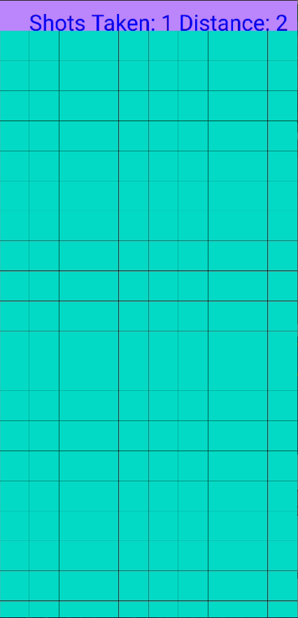
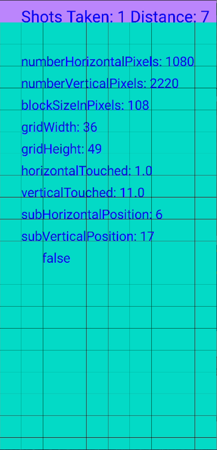

# Sub Hunter

## Attribution
Explosion sound effect: https://freesound.org/s/268557/

Explosion spritesheet: https://www.spriters-resource.com/snes/goemon3/sheet/11368/
### Graphics

## Instructions

The game board is divided into a grid of squares. Each square represents a location in the water where the submarine might be hiding.

The goal of the game is to find the submarine by touching squares on the game board.

Continue touching squares until you find the submarine.

Good luck and happy hunting!

## Video
{:width="800" height="450"}

## Screenshoots

